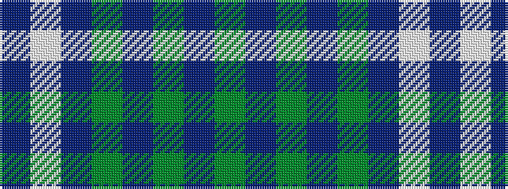

BWBGBGBG

It is a 8 stripe tartan.

<figure class="pat-woven">

<figcaption>idealised sample</figcaption>
</figure>

## Colour Sequence



## Tartans with this colour sequence

| Tartans |
|---------------|
| [Grey Watch, Dress](/setts/s8/y9do1y1do1y1do7w7do2~x4/)|
||
