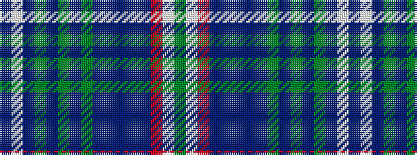

BWBGBGBGBBBBBRWG

It is a 16 stripe tartan.

<figure class="pat-woven">

<figcaption>idealised sample</figcaption>
</figure>

## Colour Sequence



## Tartans with this colour sequence

| Tartans |
|---------------|
| [Missouri Dress (Proposed) (District)](/variants/s16/g4w2r2t3db3do2db2do2g2do2g3do2g8do6w8t2~x2/)|
||
