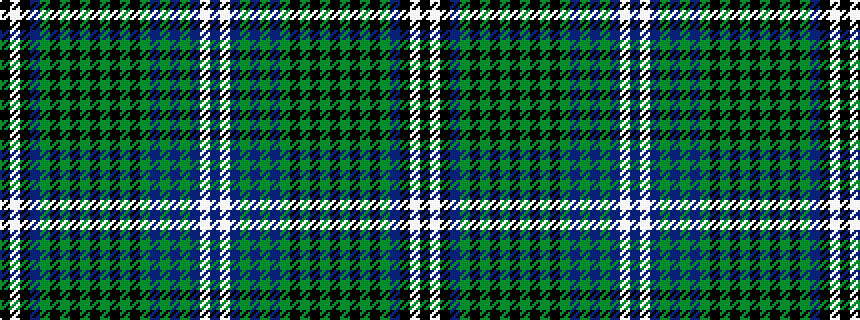

BWBGBGBGKGKGKGKGKGBKWK

It is a 22 stripe tartan.

<figure class="pat-woven">

<figcaption>idealised sample</figcaption>
</figure>

## Colour Sequence



## Tartans with this colour sequence

| Tartans |
|---------------|
| [Wilson-Blyth](/variants/s22/db22lb2db3dg3db3dg3db3dg21k3dg3k3dg3k3dg3k3dg21k15dg3db3k6lb2k15~x2/)|
||
| [Wilson-Blyth Name Tartan](/variants/s22/dt22lb2dt3dg3dt3dg3dt3dg21k3dg3k3dg3k3dg3k3dg21k15dg3dt3k6lb2k15~x2/)|
||
