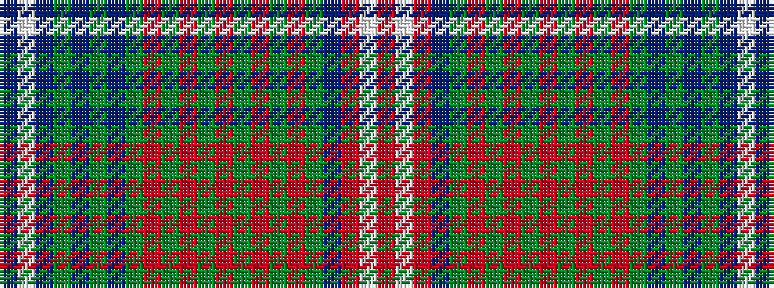

BWBGBGBGRGRGRGRGRGBRWR

It is a 22 stripe tartan.

<figure class="pat-woven">

<figcaption>idealised sample</figcaption>
</figure>

## Colour Sequence



## Tartans with this colour sequence

| Tartans |
|---------------|
| [Wilson (Clan)](/variants/s22/db45w4db6g6db6g6db6g37r6g6r6g6r6g6r6g39r27g6db6r12w4r30/)|
||
| [Wilson (Janet) #2](/variants/s22/db30w2t3dg3t3dg3t3dg16r3dg3r3dg3r3dg3r3dg25r15dg4t4r8w2r15~x2/)|
||
| [Wilson, Janet](/variants/s22/db30w2t3g3t3g3t3g16r3g3r3g3r3g3r3g25r15g4t4r8w2r15~x2/)|
||
| [Wilson, Janet (1780 Original)](/variants/s22/dp30w2t3dg3t3dg3t3dg16r3dg3r3dg3r3dg3r3dg25r15dg4t4r8w2r15~x2/)|
||
