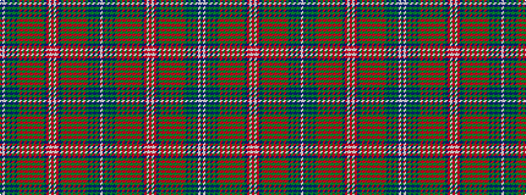

BWBGBGBGRGRGRGRGRGBRWRWRBGRGRGRGRGRGBGBGBW

It is a 42 stripe tartan.

<figure class="pat-woven">

<figcaption>idealised sample</figcaption>
</figure>

## Colour Sequence



## Tartans with this colour sequence

| Tartans |
|---------------|
| [Wilson (Janet)](/variants/s42/db45w4db6g6db6g6db6g37r6g6r6g6r6g6r6g39r27g6db6r12w4r30/)|
||
