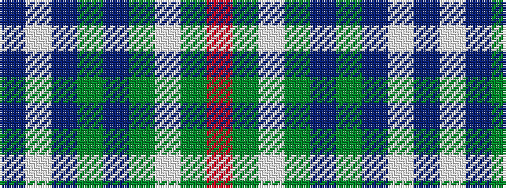

BWBGBGWGR

It is a 9 stripe tartan.

<figure class="pat-woven">

<figcaption>idealised sample</figcaption>
</figure>

## Colour Sequence



## Tartans with this colour sequence

| Tartans |
|---------------|
| [Lord Arran (Corporate)](/variants/s9/r3dy1w12dy2db2dy2db14w2db2~x2/)|
||
