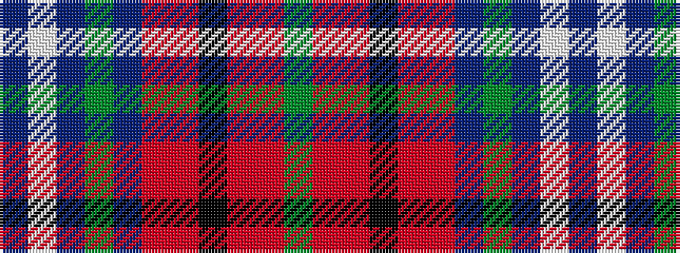

BWBGBRRKRRG

It is a 11 stripe tartan.

<figure class="pat-woven">

<figcaption>idealised sample</figcaption>
</figure>

## Colour Sequence



## Tartans with this colour sequence

| Tartans |
|---------------|
| [Pride of Scotland Dress (Dance)](/setts/s11/g9mi2m2k3m18mi1db2g2db19w33db2~x2/)|
||
