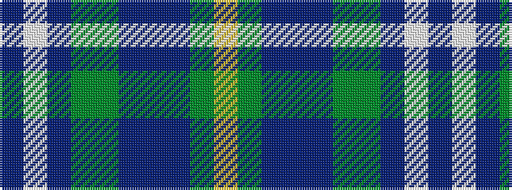

BWBGGBBBGY

It is a 10 stripe tartan.

<figure class="pat-woven">

<figcaption>idealised sample</figcaption>
</figure>

## Colour Sequence



## Tartans with this colour sequence

| Tartans |
|---------------|
| [State Seal of Nebraska (Fashion)](/variants/s10/lo7g11db4t31db4g11dy4db14lb3db4~x2/)|
||
