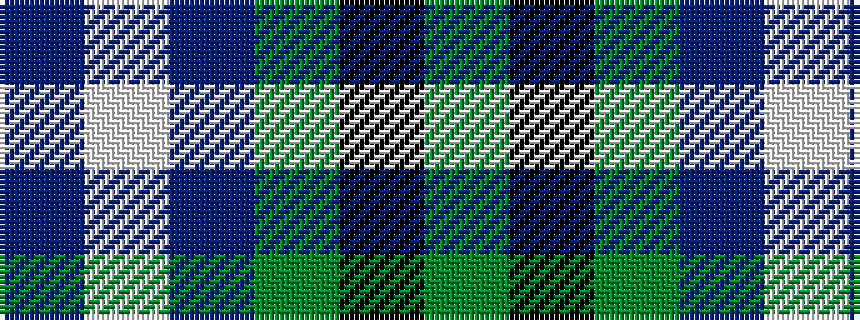

BWBGKG

It is a 6 stripe tartan.

<figure class="pat-woven">

<figcaption>idealised sample</figcaption>
</figure>

## Colour Sequence



## Tartans with this colour sequence

| Tartans |
|---------------|
| [Lawrence of Broughty Ferry](/setts/s6/dg20k2dg20dp25w2n3~x2/)|
||
| [Lawrence of Broughty Ferry (Corporat](/setts/s6/g20k2g20dp25w2t3~x2/)|
||
