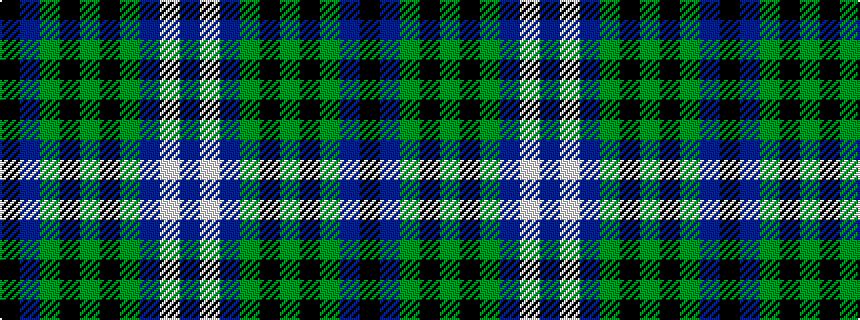

BWBGKGKGBK

It is a 10 stripe tartan.

<figure class="pat-woven">

<figcaption>idealised sample</figcaption>
</figure>

## Colour Sequence



## Tartans with this colour sequence

| Tartans |
|---------------|
| [Smeaton](/variants/s10/dt12w2dt7g15k2g4k2g15dt2k7~x2/)|
||
| [Smeaton #2 (Name)](/variants/s10/db12w2db7g15k2g4k2g15db2k7~x2/)|
||
