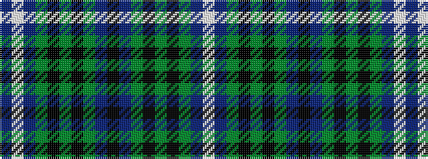

BWBGKGKGBKBGKGKGBW

It is a 18 stripe tartan.

<figure class="pat-woven">

<figcaption>idealised sample</figcaption>
</figure>

## Colour Sequence



## Tartans with this colour sequence

| Tartans |
|---------------|
| [Smeaton (Wedding) #2](/setts/s18/db12w2db7g15k2g4k2g15db2k7~x2/)|
||
