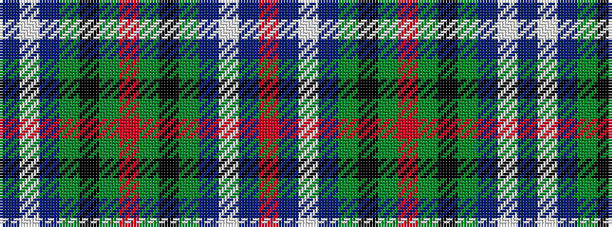

BWBGKGRGKGBWBR

It is a 14 stripe tartan.

<figure class="pat-woven">

<figcaption>idealised sample</figcaption>
</figure>

## Colour Sequence



## Tartans with this colour sequence

| Tartans |
|---------------|
| [Inverness](/setts/s14/r36db3w1db6g1k1g1r9~x4/)|
||
