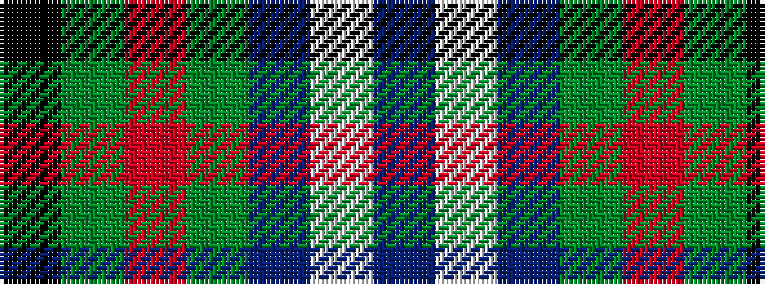

BWBGRGK

It is a 7 stripe tartan.

<figure class="pat-woven">

<figcaption>idealised sample</figcaption>
</figure>

## Colour Sequence



## Tartans with this colour sequence

| Tartans |
|---------------|
| [Isle of Cumbrae (Corporate)](/setts/s7/k3y3r3y28n28lb2n2~x2/)|
||
