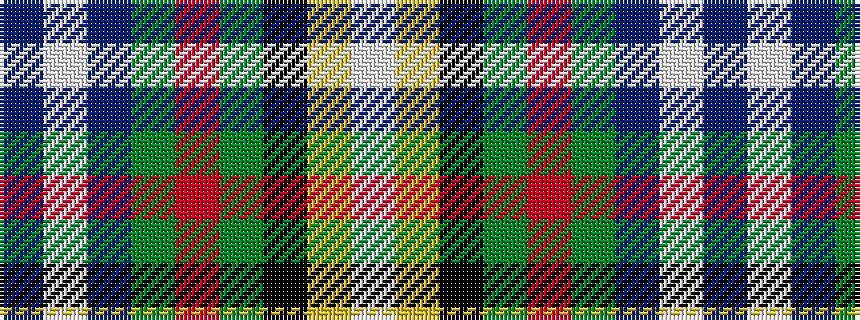

BWBGRGKYW

It is a 9 stripe tartan.

<figure class="pat-woven">

<figcaption>idealised sample</figcaption>
</figure>

## Colour Sequence



## Tartans with this colour sequence

| Tartans |
|---------------|
| [Mohammed, Abu Hassan (Personal)](/setts/s9/db60w1db6g10r1g7k2lo2w2~x2/)|
||
