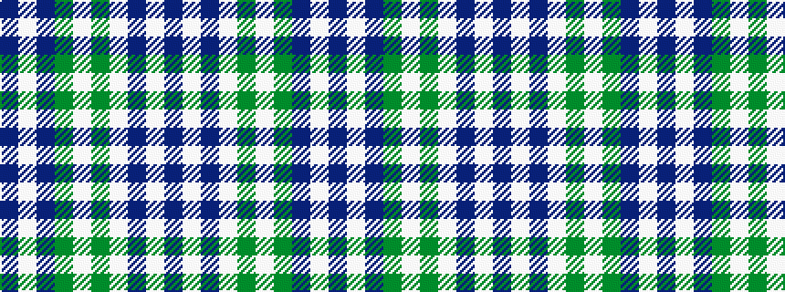

BWBGWGWBWB

It is a 10 stripe tartan.

<figure class="pat-woven">

<figcaption>idealised sample</figcaption>
</figure>

## Colour Sequence



## Tartans with this colour sequence

| Tartans |
|---------------|
| [Fraser Arisaid](/variants/s10/dt14lb2dt3lb2g10lb32g10dt10lb2dt3~x2/)|
||
| [Fraser, Arisaid](/variants/s10/db14w2db3w2g10w32g10db10w2db3~x2/)|
||
