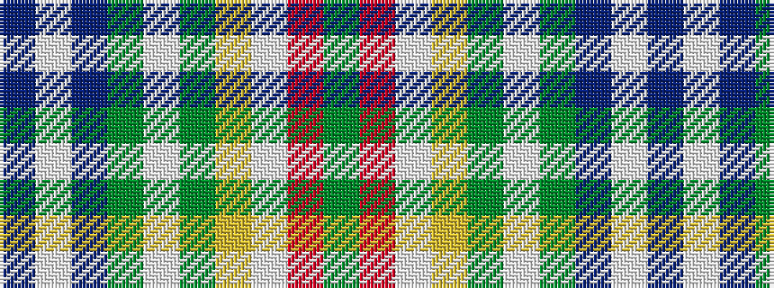

BWBGWGYWRG

It is a 10 stripe tartan.

<figure class="pat-woven">

<figcaption>idealised sample</figcaption>
</figure>

## Colour Sequence



## Tartans with this colour sequence

| Tartans |
|---------------|
| [Lévesque, Pascal (Personal)](/setts/s10/dg8r2lb3ly2dg4lbi4dg14db2lbi2db2~x2/)|
||
