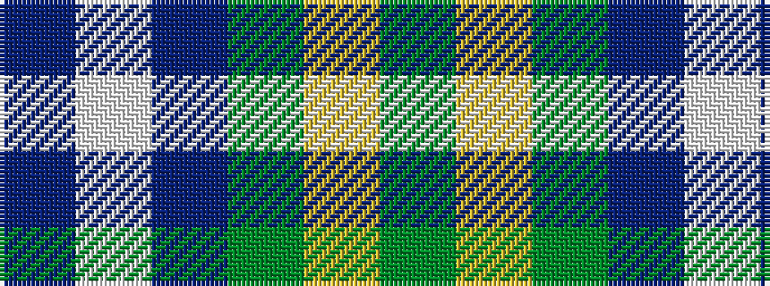

BWBGYG

It is a 6 stripe tartan.

<figure class="pat-woven">

<figcaption>idealised sample</figcaption>
</figure>

## Colour Sequence



## Tartans with this colour sequence

| Tartans |
|---------------|
| [St. Andrew Society, Sao Paulo (Corp)](/variants/s6/db5w3db36g38ly5g5~x2/)|
||
