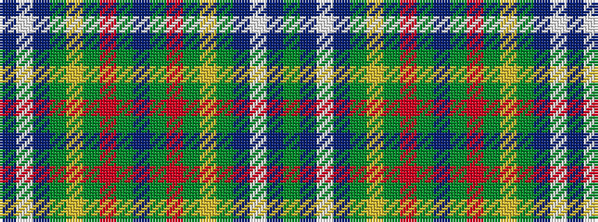

BWBGYGRGBGRGYGBWBG

It is a 18 stripe tartan.

<figure class="pat-woven">

<figcaption>idealised sample</figcaption>
</figure>

## Colour Sequence



## Tartans with this colour sequence

| Tartans |
|---------------|
| [Harkness Hunting #2](/variants/s18/g10n2w2n16g6ly2g4r2g3n6~x4/)|
||
