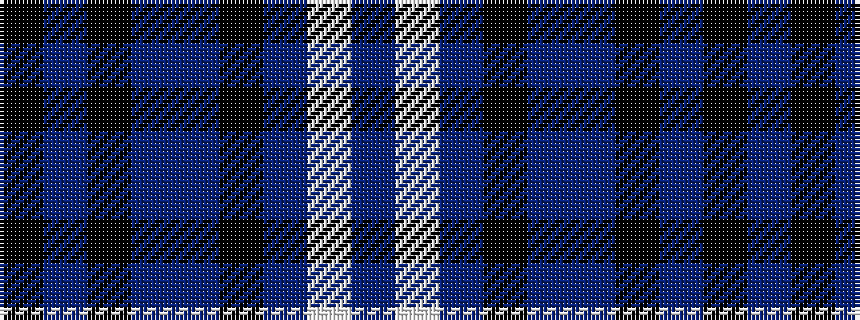

BWBKBBKBK

It is a 9 stripe tartan.

<figure class="pat-woven">

<figcaption>idealised sample</figcaption>
</figure>

## Colour Sequence



## Tartans with this colour sequence

| Tartans |
|---------------|
| [Cahonas Scotland](/setts/s9/k5b3k3b23n4k25n23lb3n5~x2/)|
||
