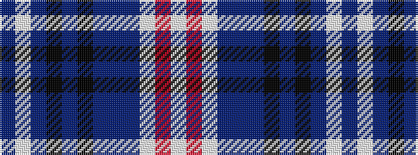

BWBKBKBBBWRW

It is a 12 stripe tartan.

<figure class="pat-woven">

<figcaption>idealised sample</figcaption>
</figure>

## Colour Sequence



## Tartans with this colour sequence

| Tartans |
|---------------|
| [Anglicare (Corporate)](/setts/s12/dbi12w4dbi4k12db12k4db8dbi12t12w11r4w8/)|
||
