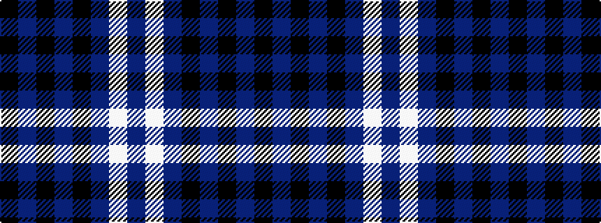

BWBKBKBK

It is a 8 stripe tartan.

<figure class="pat-woven">

<figcaption>idealised sample</figcaption>
</figure>

## Colour Sequence



## Tartans with this colour sequence

| Tartans |
|---------------|
| [Pride of Kinross](/variants/s8/k20db2k6db2k4db27w2db8~x2/)|
||
