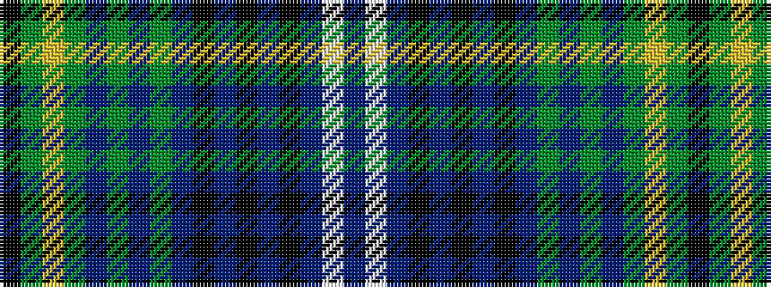

BWBKBKBKBGBGBGYGK

It is a 17 stripe tartan.

<figure class="pat-woven">

<figcaption>idealised sample</figcaption>
</figure>

## Colour Sequence



## Tartans with this colour sequence

| Tartans |
|---------------|
| [Kennedy Dress, (Pendleton)](/setts/s17/k2g2lo1g2dp1g2dp1g10dt3k2dt2k2dt2k2dt3w9dp2~x2/)|
||
