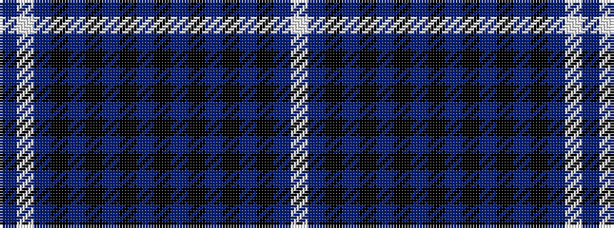

BWBKBKBKBKBKBKBKBW

It is a 18 stripe tartan.

<figure class="pat-woven">

<figcaption>idealised sample</figcaption>
</figure>

## Colour Sequence



## Tartans with this colour sequence

| Tartans |
|---------------|
| [Ironside (Personal)](/setts/s18/k40dp2k6b2k2b2k10dp4w2dp5~x2/)|
||
