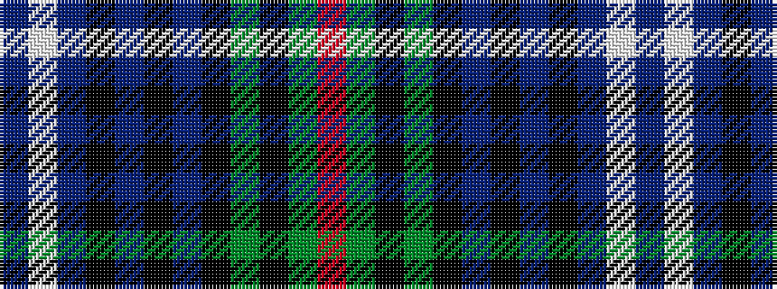

BWBKBKBKGKGR

It is a 12 stripe tartan.

<figure class="pat-woven">

<figcaption>idealised sample</figcaption>
</figure>

## Colour Sequence



## Tartans with this colour sequence

| Tartans |
|---------------|
| [Urquhart](/setts/s12/db2lb1db12k1db2k1db4k12dg24k1dg2r1~x2/)|
||
| [Urquhart - 1842 (Clan)](/setts/s12/db4w2db24k3db3k3db8k24g48k3g3r2~x2/)|
||
| [Urquhart, White Line](/setts/s12/db4w2db24k3db3k3db8k24g48k3g3r2/)|
||
