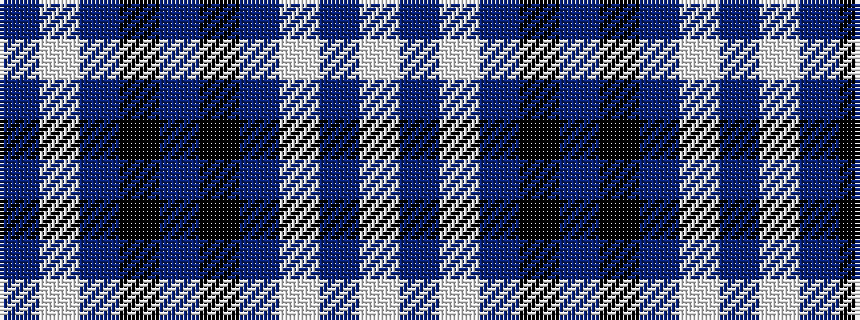

BWBKBKBWBW

It is a 10 stripe tartan.

<figure class="pat-woven">

<figcaption>idealised sample</figcaption>
</figure>

## Colour Sequence



## Tartans with this colour sequence

| Tartans |
|---------------|
| [MacGregor Turquoise Dress Fashion Tartan](/variants/s10/w52t22w6t8k1dp3~x2/)|
||
