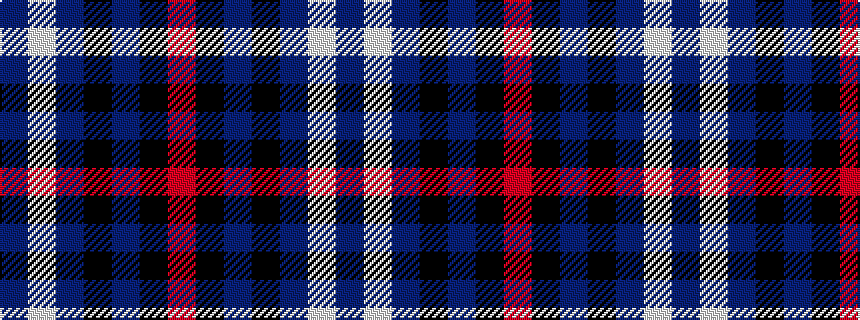

BWBKBKR

It is a 7 stripe tartan.

<figure class="pat-woven">

<figcaption>idealised sample</figcaption>
</figure>

## Colour Sequence



## Tartans with this colour sequence

| Tartans |
|---------------|
| [Instakilt, Blue (Fashion)](/variants/s7/b8w4b50k12b4k15r5~x2/)|
||
