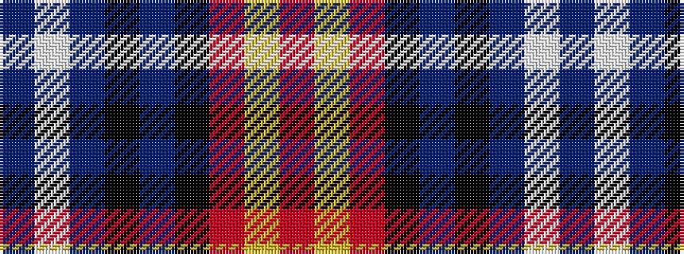

BWBKBKRYR

It is a 9 stripe tartan.

<figure class="pat-woven">

<figcaption>idealised sample</figcaption>
</figure>

## Colour Sequence



## Tartans with this colour sequence

| Tartans |
|---------------|
| [Caledon (Corporate)](/variants/s9/n8w3n25k3n4k8r31ly2r5~x2/)|
||
