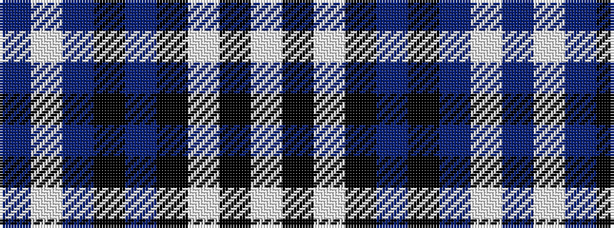

BWBKBKWKW

It is a 9 stripe tartan.

<figure class="pat-woven">

<figcaption>idealised sample</figcaption>
</figure>

## Colour Sequence



## Tartans with this colour sequence

| Tartans |
|---------------|
| [Scotsburn Croft](/setts/s9/lt16k3lt16k26dp4k26n20w3n8/)|
||
