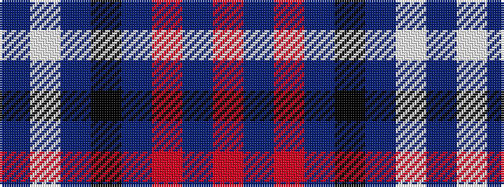

BWBKBRBR

It is a 8 stripe tartan.

<figure class="pat-woven">

<figcaption>idealised sample</figcaption>
</figure>

## Colour Sequence



## Tartans with this colour sequence

| Tartans |
|---------------|
| [Masai Shuka 29 (Artefact)](/setts/s8/r5db20r3db20k6db3lb2db1~x2/)|
||
