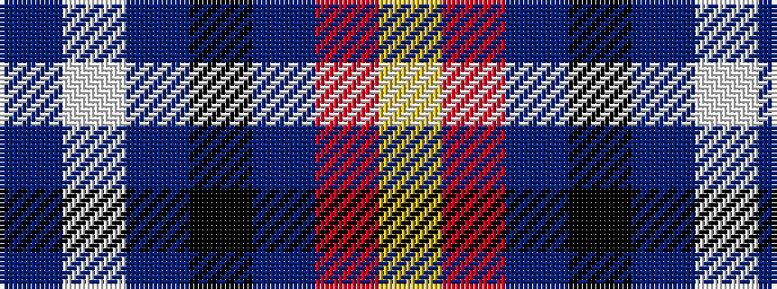

BWBKBRY

It is a 7 stripe tartan.

<figure class="pat-woven">

<figcaption>idealised sample</figcaption>
</figure>

## Colour Sequence



## Tartans with this colour sequence

| Tartans |
|---------------|
| [Dignan](/setts/s7/ly2r1t16k5p2w11p1~x4/)|
||
| [Dignan School of Dancing](/setts/s7/lo4r2b32k10dp4lb21dp2~x2/)|
||
