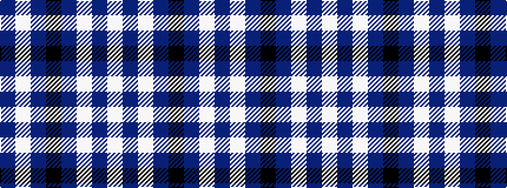

BWBKBWBW

It is a 8 stripe tartan.

<figure class="pat-woven">

<figcaption>idealised sample</figcaption>
</figure>

## Colour Sequence



## Tartans with this colour sequence

| Tartans |
|---------------|
| [Alaska Highlanders Pipes & Drums Corporate Tartan](/variants/s8/db9lb27db2k4db2lb10db2w3~x2/)|
||
