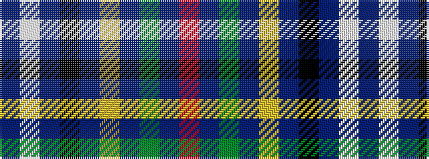

BWBKBYBGBR

It is a 10 stripe tartan.

<figure class="pat-woven">

<figcaption>idealised sample</figcaption>
</figure>

## Colour Sequence



## Tartans with this colour sequence

| Tartans |
|---------------|
| [Pride of the Highlands (Fashion)](/setts/s10/dp7lb2dp28k7dp3lo2dp2g2dp13r2~x2/)|
||
