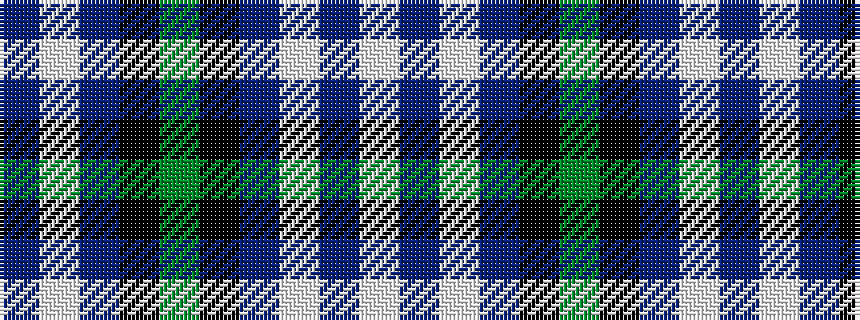

BWBKGKBWBW

It is a 10 stripe tartan.

<figure class="pat-woven">

<figcaption>idealised sample</figcaption>
</figure>

## Colour Sequence



## Tartans with this colour sequence

| Tartans |
|---------------|
| [MacGregor Dress Blue Fancy Tartan](/variants/s10/w52db22w6db8k1g3~x2/)|
||
