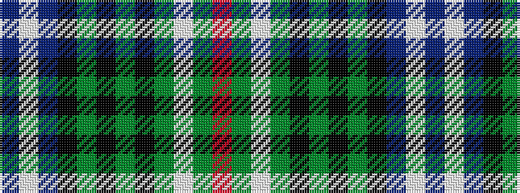

BWBKGKGKGWGR

It is a 12 stripe tartan.

<figure class="pat-woven">

<figcaption>idealised sample</figcaption>
</figure>

## Colour Sequence



## Tartans with this colour sequence

| Tartans |
|---------------|
| [Kerby/Kirby](/variants/s12/r6g1lb2g24k3g3k3g3k8db8lb2db4~x2/)|
||
