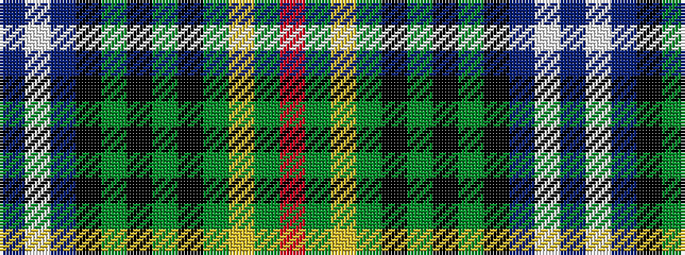

BWBKGKGKGYGR

It is a 12 stripe tartan.

<figure class="pat-woven">

<figcaption>idealised sample</figcaption>
</figure>

## Colour Sequence



## Tartans with this colour sequence

| Tartans |
|---------------|
| [Kerby (Personal)](/variants/s12/dp4w2dp10k10g3k3g3k2g24ly2g2r4~x2/)|
||
| [Kerby, from the Tennessee Cumberland Basin](/variants/s12/dp4w2dp10k10dg3k3dg3k2dg24ly2dg2r4~x2/)|
||
