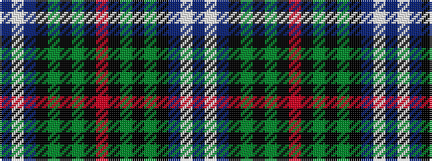

BWBKGKGKRKGKGKBWB

It is a 17 stripe tartan.

<figure class="pat-woven">

<figcaption>idealised sample</figcaption>
</figure>

## Colour Sequence



## Tartans with this colour sequence

| Tartans |
|---------------|
| [Psychological Operations Regiment](/variants/s17/dt5lb2dt12k21dg12k4dg4k4r4k4dg4k4dg12k21dt12lb2dt4~x2/)|
||
| [Psychological Operations Regiment](/variants/s17/n5lb2n12k21dg12k4dg4k4r4k4dg4k4dg12k21n12lb2n4~x2/)|
||
