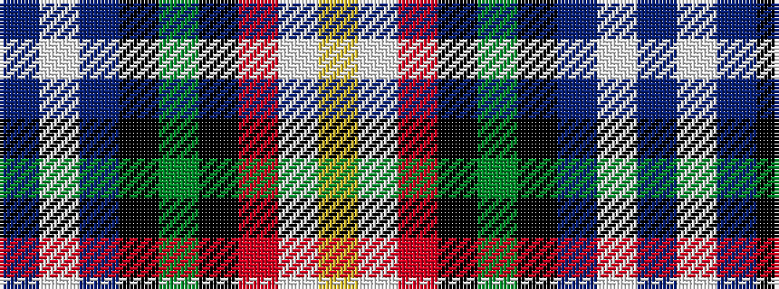

BWBKGKRWY

It is a 9 stripe tartan.

<figure class="pat-woven">

<figcaption>idealised sample</figcaption>
</figure>

## Colour Sequence



## Tartans with this colour sequence

| Tartans |
|---------------|
| [Brooke](/variants/s9/b2lb1b2k16g20k14r2w2ly2~x2/)|
||
