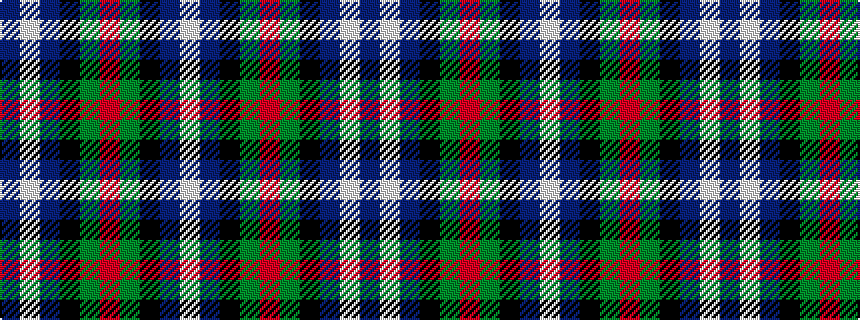

BWBKGRGKBW

It is a 10 stripe tartan.

<figure class="pat-woven">

<figcaption>idealised sample</figcaption>
</figure>

## Colour Sequence



## Tartans with this colour sequence

| Tartans |
|---------------|
| [Dalmeny - 2002 (Fashion)](/variants/s10/db11w2db11k4g8r1~x2/)|
||
