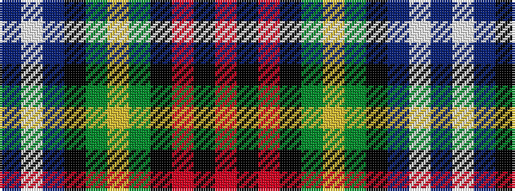

BWBKGYGKRKR

It is a 11 stripe tartan.

<figure class="pat-woven">

<figcaption>idealised sample</figcaption>
</figure>

## Colour Sequence



## Tartans with this colour sequence

| Tartans |
|---------------|
| [Hunnisett/Edinchip (Name)](/setts/s11/db38w2db2k10g2ly2g22k3r3k3r3~x2/)|
||
