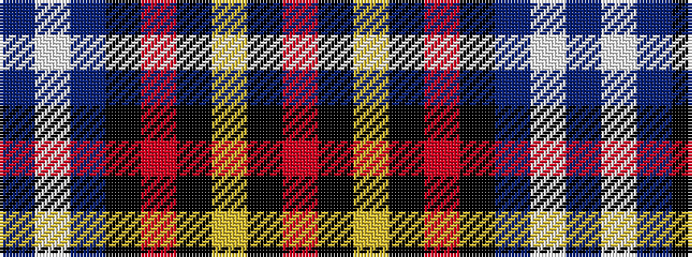

BWBKRKYKR

It is a 9 stripe tartan.

<figure class="pat-woven">

<figcaption>idealised sample</figcaption>
</figure>

## Colour Sequence



## Tartans with this colour sequence

| Tartans |
|---------------|
| [Superstition Fire Honor Guard Pipes](/setts/s9/db12w1db2k3r15k1ly2k39r2~x2/)|
||
| [Superstition Fire Honor Guard Pipes & Drums](/setts/s9/t12w1t2k3r15k1lo2k39r2~x2/)|
||
