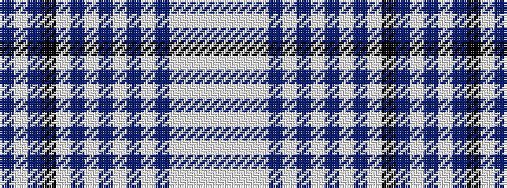

BWBKWBWBWBWBWWWW

It is a 16 stripe tartan.

<figure class="pat-woven">

<figcaption>idealised sample</figcaption>
</figure>

## Colour Sequence



## Tartans with this colour sequence

| Tartans |
|---------------|
| [Purple Rain](/variants/s16/dp4lb2dp24k1lb8dp2lb1dp2lb4dp2lb1dp2lb16w2lb1w4~x2/)|
||
