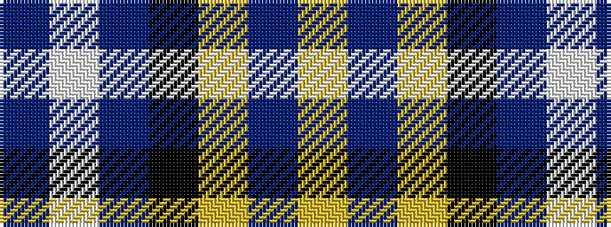

BWBKYBY

It is a 7 stripe tartan.

<figure class="pat-woven">

<figcaption>idealised sample</figcaption>
</figure>

## Colour Sequence



## Tartans with this colour sequence

| Tartans |
|---------------|
| [East Carolina University](/setts/s7/p13w2p8k5ly10p75ly3~x2/)|
||
| [East Carolina University (Corp.)](/setts/s7/dp13w2dp8k5lo10dp75lo3~x2/)|
||
