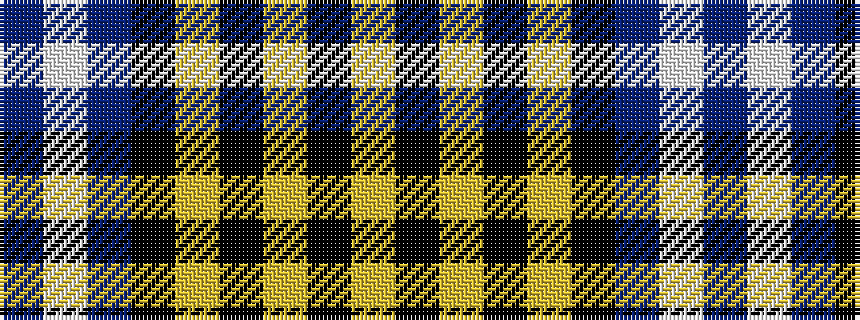

BWBKYKYKY

It is a 9 stripe tartan.

<figure class="pat-woven">

<figcaption>idealised sample</figcaption>
</figure>

## Colour Sequence



## Tartans with this colour sequence

| Tartans |
|---------------|
| [(1) Abercrombie](/variants/s9/b27w2b14k14lg4k4lg4k4lg27/)|
||
