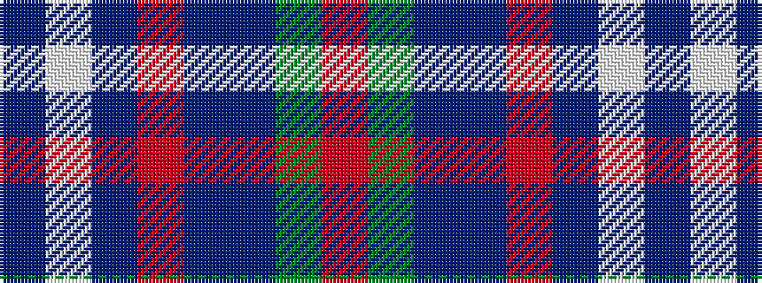

BWBRBBGR

It is a 8 stripe tartan.

<figure class="pat-woven">

<figcaption>idealised sample</figcaption>
</figure>

## Colour Sequence



## Tartans with this colour sequence

| Tartans |
|---------------|
| [Blairmore](/setts/s8/db34w5db5r5db5dr26g33o6~x2/)|
||
