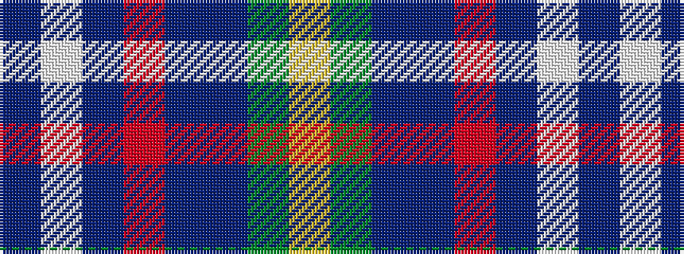

BWBRBBGY

It is a 8 stripe tartan.

<figure class="pat-woven">

<figcaption>idealised sample</figcaption>
</figure>

## Colour Sequence



## Tartans with this colour sequence

| Tartans |
|---------------|
| [Blairmore House](/setts/s8/db17w2db2r2db2do12dg16lo3~x4/)|
||
| [Blairmore House (Corporate)](/setts/s8/db17lb2db2r2db2do12dg16lo3~x4/)|
||
