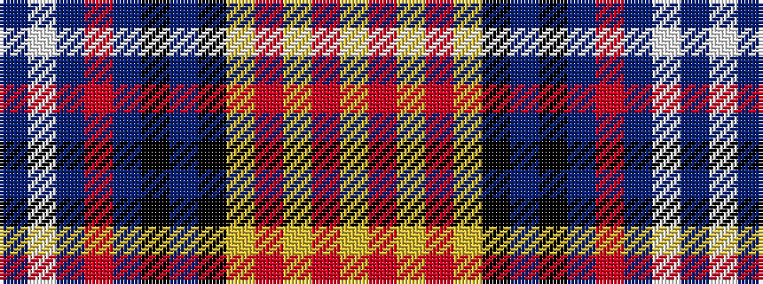

BWBRBKBKYRYRY

It is a 13 stripe tartan.

<figure class="pat-woven">

<figcaption>idealised sample</figcaption>
</figure>

## Colour Sequence



## Tartans with this colour sequence

| Tartans |
|---------------|
| [Les Coeurs de Lions en Bleu](/variants/s13/t10w18t4o6t45k30t4k4ly4r4ly4r4ly4/)|
||
