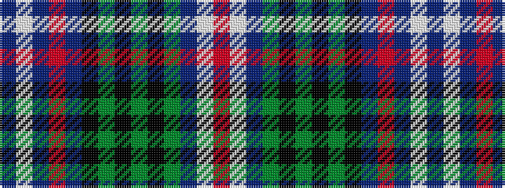

BWBRBKGKGKGBWR

It is a 14 stripe tartan.

<figure class="pat-woven">

<figcaption>idealised sample</figcaption>
</figure>

## Colour Sequence



## Tartans with this colour sequence

| Tartans |
|---------------|
| [Scotland's National Dress](/setts/s14/dt14lb2dt2r2dt3k12g14k2g4k2g14dt14lb14r2~x2/)|
||
| [Scottish National Dress](/setts/s14/db12w2db2r2db3k11g12k2g3k2g12db12w13r2~x2/)|
||
