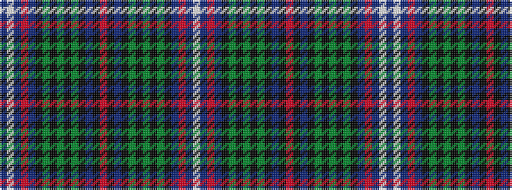

BWBRBKGKGKGKBKRKBKGKGKGKBRBW

It is a 28 stripe tartan.

<figure class="pat-woven">

<figcaption>idealised sample</figcaption>
</figure>

## Colour Sequence



## Tartans with this colour sequence

| Tartans |
|---------------|
| [Scotland's National](/variants/s28/dt12w2dt2r2dt2k10g12k2g4k2g12k10dt12k2r3~x2/)|
||
