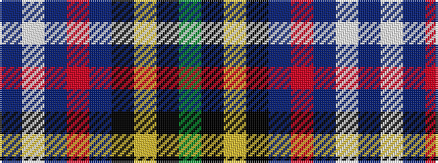

BWBRBKYKG

It is a 9 stripe tartan.

<figure class="pat-woven">

<figcaption>idealised sample</figcaption>
</figure>

## Colour Sequence



## Tartans with this colour sequence

| Tartans |
|---------------|
| [St Andrew's College](/setts/s9/db18w2db2r3db21k28ly1k1g2~x2/)|
||
