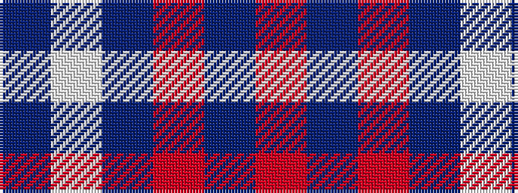

BWBRBR

It is a 6 stripe tartan.

<figure class="pat-woven">

<figcaption>idealised sample</figcaption>
</figure>

## Colour Sequence



## Tartans with this colour sequence

| Tartans |
|---------------|
| [Sail Chalmadale](/setts/s6/db4w1db17ri28dp17r2~x2/)|
||
